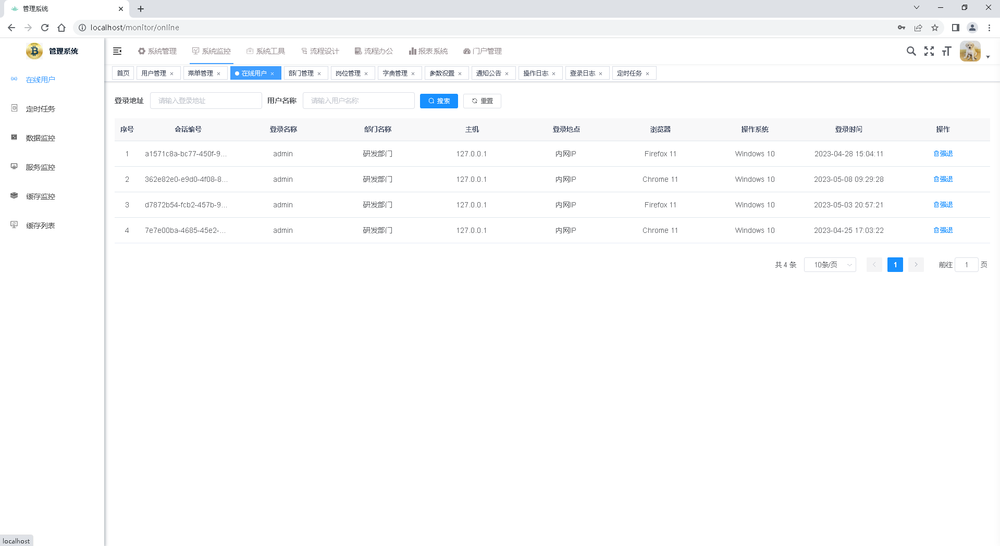

<h1 align="center" style="margin: 30px 0 30px; font-weight: bold;">Gen-Sys</h1>
<h4 align="center">基于SpringBoot+Vue前后端分离的Java快速开发框架</h4>

	

## 平台简介

Gen-Sys是一套基于若依的快速开发平台。

* 前端采用Vue、Element UI。
* 后端采用Spring Boot、Spring Security、Redis & Jwt。
* 权限认证使用Jwt，支持多终端认证系统。
* 支持加载动态权限菜单，多方式轻松权限控制。
* 高效率开发，使用代码生成器可以一键生成前后端代码。
* 特别鸣谢：[RuoYi-Vue](https://gitee.com/y_project/RuoYi-Vue)
* 特别鸣谢：[RuoYi-flowable](https://gitee.com/tony2y/RuoYi-flowable)

## 内置功能

1.  用户管理：用户是系统操作者，该功能主要完成系统用户配置。
2.  部门管理：配置系统组织机构（公司、部门、小组），树结构展现支持数据权限。
3.  岗位管理：配置系统用户所属担任职务。
4.  菜单管理：配置系统菜单，操作权限，按钮权限标识等。
5.  角色管理：角色菜单权限分配、设置角色按机构进行数据范围权限划分。
6.  字典管理：对系统中经常使用的一些较为固定的数据进行维护。
7.  参数管理：对系统动态配置常用参数。
8.  通知公告：系统通知公告信息发布维护。
9.  操作日志：系统正常操作日志记录和查询；系统异常信息日志记录和查询。
10. 登录日志：系统登录日志记录查询包含登录异常。
11. 在线用户：当前系统中活跃用户状态监控。
12. 定时任务：在线（添加、修改、删除)任务调度包含执行结果日志。
13. 代码生成：前后端代码的生成（java、html、xml、sql）支持CRUD下载 。
14. 系统接口：根据业务代码自动生成相关的api接口文档。
15. 服务监控：监视当前系统CPU、内存、磁盘、堆栈等相关信息。
16. 缓存监控：对系统的缓存信息查询，命令统计等。
17. 在线构建器：拖动表单元素生成相应的HTML代码。
18. 连接池监视：监视当前系统数据库连接池状态，可进行分析SQL找出系统性能瓶颈。
19. 在线流程设计器
20. 在线流程表单设计器
21. 单节点配置表单
22. 多实例会签任务
23. 任务节点配置任务/执行监听器
24. 动态配置任务候选人
25. 其它流程相关功能点
26. 积木报表
27. 门户管理

## 在线体验（待发布）

- admin/123456  

演示地址：  
ruoyi-vue文档地址：http://doc.ruoyi.vip  
flowable文档：https://www.yuque.com/u1024153/icipor

## 演示图

<table>
    <tr>
        <td></td>
        <td></td>
    </tr>
    <tr>
        <td></td>
        <td></td>
    </tr>
    <tr>
        <td></td>
        <td></td>
    </tr>
    <tr>
        <td></td>
        <td></td>
    </tr>
</table>

## 亘系统交流群

QQ群：  点击按钮入群。
